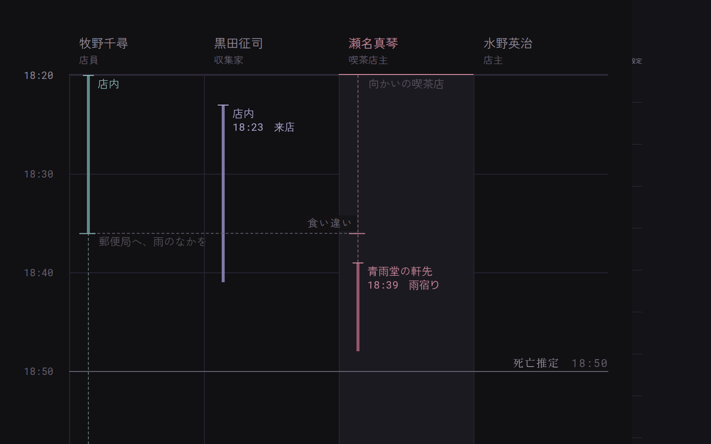

# シナリオ作成の作法

AlibAI のシナリオを一本書くための手引きです。この文書に従って書けば、機械検証を通る事件が作れます。

**この文書は `db/generate-scenario.ts` が Author LLM のシステムプロンプトとしてそのまま読み込みます。**
ここを書き換えると生成の挙動が変わります。人間向けの解説を足すときも、モデルが読んで困らない書き方にしてください。

なぜこの形式なのか、という設計の背景は [`architecture/scenario-format.md`](./architecture/scenario-format.md) にあります。
機械可読な正典は `db/scenario-definition.ts` の Zod スキーマで、この文書と食い違ったらスキーマが正しいです。

---

## 1. 何を作るのか

プレイヤーがスマホで10分ほど遊ぶ、聞き込み型の殺人事件です。

- プレイヤーは探偵として、容疑者2〜4人に話を聞く。
- 各人物は LLM が演じる。渡された人物像・知識・秘密・目的・嘘・記憶の範囲だけで喋る。
- 証言どうしの食い違いを見つけ、犯人を指し示せば終わり。

**面白さの正体は「証言の矛盾」です。** 誰かの嘘と、別の誰かの目撃が噛み合わない。その一点を作るのが仕事で、
それ以外は全部そのための舞台装置だと思ってください。矛盾が一つも生まれない配り方をしたら、その事件は失敗です。

---

## 2. 作る順序

この順番を守ってください。登場人物を先に自由に作ってから辻褄を合わせようとすると、必ず破綻します。

1. **真相を固定する。** 犯人・動機・実際に起きた出来事と時刻を決める。ここは後で変えない。
2. **事実に割る。** 起きたことを `facts` の原子的な一文へ分解する。
3. **情報を配る。** 誰がどの事実を知り、どれを隠し、どんな嘘をつくかを決める。
4. **証拠と発見を置く。** 嘘を崩す証拠、動機に辿り着く revelation を配置する。
5. **公開情報を書く。** `synopsis` と `briefing` を最後に書く。真相だけでなく、解法・着眼点・疑うべき証拠も書かない。

---

## 3. 全体の形

```yaml
schemaVersion: 1          # 常に 1
id: some-case-name        # ^[a-z0-9][a-z0-9-]{2,63}$
meta: {}
briefing: ""
floorPlan: null           # または見取り図（§9）
victim: {}                # 省略可。殺人以外の事件では書かない（§7）
facts: []                 # 1件以上
timeline: []              # 1件以上
characters: []            # 2人以上
revelations: []           # 省略可
evidences: []
solution: {}
```

文章はすべて日本語。ID は英小文字・数字・ハイフンだけにしてください。

---

## 4. `meta` と `briefing`

```yaml
meta:
  title: 月見荘、十七回忌の夜      # 1〜100文字
  synopsis: 老舗旅館の女将が…       # 1〜500文字
  category: 館もの                 # 1〜50文字、一覧に出る短いラベル
  difficulty: 2                    # 整数 1〜5
  estimatedMinutes: 10             # 整数 5〜30
```

`title` も公開情報です。**トリック名・中心証拠・アリバイの弱点・時刻のずれ・目撃の誤認など、解法へ直結する語をタイトルに入れてはいけません。** 原則として「施設・土地・時代・天候・事件の場」だけで題を付けます。謎めかせるために決定的な物品や記録を題名へ出すのも避けてください。

`synopsis` はシナリオ一覧で見せる短い導入、`briefing` はゲーム開始時にプレイヤーへ読み上げる事件の記録です。段落は空行で区切り、UIが1段落ずつ開きます。

**書いてよいのは、聞き込みを始める前に知っていて当然のことだけ。** 舞台、被害者、事件の発見状況、外部と隔絶されている事情、最初から公知の人物構成までに留めます。

`briefing` には被害者の**公開人物像を独立した1段落として入れます。** 役職だけで終わらせず、周囲からの評判、人柄、仕事への姿勢、その場所でどんな存在だったかを書いてください。「慕われていた」「厳格だが頼られていた」「気難しいが本には誠実だった」のような、事件前から共有されていた印象です。毎回善人にせず、慕われた人・恐れられた人・尊敬された変人・功績と悪評が半々の人など幅を持たせます。特定の容疑者との対立や、犯行動機へ直接つながる事情はここへ書きません。

`briefing` はNPCにも事件の共通知識として渡されます。したがって、ここへ書いた公開人物像や施設背景について尋ねられたとき、NPCはその前提を共有したうえで答えます。

次は公開層に書いてはいけません。

- 特定人物のアリバイや、そのアリバイを支える記録
- 決定的な物証・目撃・時刻差・機械ログの意味
- 「この記録は何を示すのか」「この目撃は本人なのか」のような、疑う対象を指定する文
- 「ただし」「しかし」「ところが」で表面的な事実をひっくり返し、トリックの入口を示す文
- 「確かめてください」「見極めてください」「時系列を組み直してください」のような、解き方の指示
- 犯人候補を一人だけ目立たせる詳細な主張

公開文の役割は**事件へ入るための状況説明だけ**です。読んだ時点で「何を疑えばよいか」が分かったら、それもネタバレです。犯人だけでなく、推理の入口まで聞き込みの中に残してください。

---

## 5. `facts` — 事件世界の事実

真偽が固定された、原子的な事実の一覧です。**ここが唯一の原本**で、人物・時系列・証拠はすべてここを ID で参照します。

```yaml
facts:
  - id: fukagawa-left-1915
    statement: 19時15分ごろ、深川誠也が電話のため食堂の席を外した
    kind: observation        # 全件に書く（§後述）
```

- `statement` は**文脈なしで意味が通る一文**にする。誰の視点でもない三人称で書く。
- 一つの `statement` に複数の事実を詰め込まない。「席を外し、45分に戻った」は2件に割る。
- `kind` は `observation` / `physical` / `testimony` / `motive` / `truth` / `other`。

**`kind` はアリバイ表の線の種類を決めます。** 出来事を構成する事実に `physical`（物証）か
`observation`（第三者が見たこと）が一つでも混じれば**実線**（裏付けあり）、`testimony` などだけなら
**破線**（本人の申告のみ）になります。本人が黙っても残るものが物証と目撃だから、という区別です。

`kind` を省略すると、その事実は裏付けとして数えられません。**全件に書いてください。**
一件でも落とすと、本当は物証で固まっている時間帯が破線で出て、プレイヤーが読み違えます。

同じ事実を人物ごとに文章でコピーしてはいけません。時刻を一箇所直したときに他が古いまま残ります。

---

## 6. `timeline` — 実際に起きた順番

```yaml
timeline:
  - id: fukagawa-leaves
    at: "19:15"                        # "HH:mm" で統一する
    location: 廊下                      # アリバイ表に出る在所。画面に出る文字そのもの
    room: corridor                     # 見取り図の部屋ID。図のある事件だけ。省略可
    participants: [fukagawa]           # その時刻に location に居た人
    witnesses: [kiryu]                 # 離れて見ていた人。線は引かれない。省略可
    facts: [fukagawa-left-1915]        # 1件以上、必須
    record: 内線記録                    # 時刻を留めた記録の名前。裏付けのある出来事には必ず
    description: 深川が電話のため一時的に席を外す。桐生が廊下でこれを見ている。
```

- `at` は `"HH:mm"`。日を跨ぐ事件でない限り ISO 8601 は使わない。**同一シナリオ内で両形式を混ぜてはいけません。**
- `description` は**結末画面にそのまま並ぶ一文**なので、読み物として書く。省くと `facts` を ` / ` で機械連結したものが出て不格好になります。全イベントに書いてください。
- 被害者は `characters` に居ないので `participants` にも `witnesses` にも書けません。
- `location` は**画面にそのまま出る文字**です。部屋のIDを書く欄ではありません（それは `room`）。
- `room` は見取り図がある事件でだけ書けます。図の無い事件で書くと検証で落ちます。

### timeline はアリバイ表になる

聞き込みの画面には、縦に時刻・横に人が並ぶ**アリバイ表**があります。プレイヤーが手掛かりを
掴むたび、そこへ線が一本ずつ増えていきます。線を作っているのがこの `timeline` です。

- **`participants` が、誰の列に線が引かれるかを決めます。** 空にすると、その出来事は表に出ません。
  **`location` に居た人だけを書いてください。** 関わった人ではありません。
- **離れて見ていた人は `witnesses` へ。** こちらには線が引かれません。
  「Aが書斎に入る。廊下でBとすれ違う」を一つの出来事にして両方を `participants` に載せると、
  **表の上ではBまで書斎に居たことになります。** Bは `witnesses` に置き、
  B自身がどこに居たかは**別の出来事として書いてください**（Aは書斎、Bは廊下）。
  同じ人を両方に載せると検証で落ちます。居た場所は一つだけだからです。
- **`location` が、線に添う在所の文字になります。**「郵便窓口」「裏の路地」のような**短い名詞句**にする。
  列の幅は狭く、長い句は入りません。**8文字を超えないこと。** `description` の文をそのまま入れてはいけません。
- **`room`** は見取り図の部屋ID。`location` とは役割が違います。前者は図と結ぶための鍵、
  後者は画面に出る文字です。図のある事件では両方書いてください。
- **`record` は、その時刻を留めた記録の名前**です。「受付」「忘れ傘」「通報」。
  アリバイ表の目盛りに `19:08　受付` の形で添います。**裏付けのある出来事には必ず書いてください。**
  空にすると目盛りは `19:08` とだけ出て、何がその時刻を留めたのかが画面から読めなくなり、
  プレイヤーは会話へ戻って探すことになります。
  ただし**本人が言っただけの時刻には付けないこと**——記録の名前が付くと、証拠があるように見えます。
  12文字まで。
- 線の種類（実線か破線か）は `facts` の `kind` から決まります（§5 参照）。
- 線の終わりは「その人について**次に分かっている**出来事」までです。まだ発見されていない出来事は
  終端に使われないので、知らない時刻が線の長さとして漏れることはありません。最後の一本だけは
  事件の幕切れまで伸びます。
- したがって、**一人あたりの出来事が一つだけだと、幕切れまで伸びる大雑把な一本にしかなりません。**
  在所が変わる節目を一人につき三つ前後は置いてください。手掛かりを掴むたびに長い線が短く割れ、
  知るほど像が細かくなる——その手応えが、出来事の数から生まれます。

スキーマ上は `location` も `participants` も省略できますが、省略した出来事は表に出ないか、
在所が空欄の線になります。**必ず両方を入れてください。**

---

## 7. `characters` — 話を聞ける人物

2人以上、3人前後が扱いやすい。**被害者は入れません。** プレイヤーが会話できるのは容疑者と証言者だけです。

### `victim` — 話を聞けない相手

被害者は `characters` に入れず、`victim` に置きます。喋りませんが、**遺体と現場は調べられます**。

```yaml
victim:
  name: 高瀬涼子
  introduction: 老舗旅館「月見荘」女将    # 肩書きひとつぶん、60文字まで
  foundAt: "20:30"                      # 発見時刻。timeline と同じ書き方
  foundIn: 書斎                          # 発見場所。画面に出る文字。20文字まで
  foundRoom: study                      # 発見場所の部屋ID。図のある事件だけ。省略可
  estimatedDeathAt: "20:15"             # 死亡推定時刻。発見時刻とは別物
  causeOfDeath: 植物性の毒物による中毒死
  findings:                             # 調べて分かること。1件1文
    - id: single-glass
      statement: 文机に、飲みかけのグラスが一つだけ置かれている。誰かと酌み交わした跡は無い。
    - id: heir-draft
      statement: 硯箱の下に、書き直しかけの遺言書の草案が伏せてある。
      requires:                         # 省略可。段階的に見せたいときだけ
        evidences: [will-record]
```

- **`findings` には、その場で目にできるものだけを書く。** 人物の心情や動機の解釈は書かない
  ——あれは `revelations` の仕事で、ここに混ぜると「遺体を見ただけで動機が分かる」ことになります。
- 誰がやったかを書かない。見えたものだけを置き、繋ぐのはプレイヤーの仕事です。
- `findings` も `causeOfDeath` も無ければ、被害者は聞き込みの相手に並びません（調べても何も出ないので）。
- `foundIn` は `timeline` の `location` と同じ扱いです。画面に出る文字で、部屋IDは `foundRoom` へ。
- **`foundAt` と `estimatedDeathAt` は、盤面に出るときが違います。** どちらもアリバイ表を横断する
  刻限になりますが、前者は最初から、後者は探偵が手に入れてからです（docs/design/deadline-window.md）。
  - `foundAt` は**公開情報**です。「午後八時三十分ごろ、書斎で倒れているのが見つかります」と
    事件の記録（`briefing`）が語っている時刻なので、一手も打っていないうちから実線で引かれます。
  - `estimatedDeathAt` は**手に入れて初めて分かるもの**です。プレイヤーがまだ掴んでいないあいだ、
    盤面はそこを点線と `?` で囲って「まだ分かっていない」と示します。**この時刻を記録の本文に
    書かないでください。** 書けば、誰も遺体を見ていないうちから読み物のほうで漏れてしまい、
    盤面が伏せている意味が無くなります。
  - **何を掴めば開くのかは、作者が決めます。** 証拠に `revealsDeathTime: true` の印を付けてください
    （§8）。印をひとつも付けなければ、刻限は最後まで「不明」のままです。時刻を書いただけでは
    盤面に出ません——出る道を作るのも作者の仕事だからです。
  - 時刻の偽装を核にする事件では `estimatedDeathAt` を必ず入れてください。ここが無いと、線が何本
    増えても「間に合ったのか」を読む基準が最後まで画面に現れません。
- 遺体を調べるのも**質問1回ぶん**を消費します。人に訊くか現場を見るかの配分がそのままゲームになります。

### `sources: { type: victim }`

証拠と啓示の出どころに、人物・場所と並んで**遺体**を指定できます。`id` は `victim` で固定です。

```yaml
evidences:
  - id: will-draft
    label: 書き直しかけの遺言書の草案
    sources:
      - type: victim
        id: victim
```

**動機に繋がる手掛かりを、最低ひとつは遺体の側に置いてください。** 動機が人の口だけに紐づいていると、
その一人に質問が向かなかったプレイヤーは「なぜ殺されたのか」が分からないまま告発に進むことになります。
遺体は逃げも黙秘もしない、最後の情報源です。

```yaml
characters:
  - id: fukagawa
    name: 深川誠也
    publicIntroduction: 月見荘の経理を長年任されている税理士。  # プレイヤーへ最初から公開
    personality: 気弱で愛想笑いが多い税理士。追い詰められると目が泳ぐ。  # NPC内部用、非公開
    goals:
      - 横領が誰にもバレないまま今夜をやり過ごしたい
    knowledge:                         # facts[].id
      - fukagawa-left-1915
    secrets:
      - fact: fukagawa-at-phone-booth
        disclosure: never
    lies:
      - id: fukagawa-study-alibi
        about: fukagawa-at-phone-booth
        claim: 19時30分に書斎で涼子さんと会計の件を話した
        strategy: maintain-until-contradicted
    memories:
      - id: the-night-before
        detail: 前日の夜に呼び止められたときの、心臓が縮み上がるような感覚をまだ覚えている。
    relationships:
      - character: mizuki              # characters[].id
        relation: 顔見知り
        attitude: 苦手意識がある        # 省略可
```

### `places` — 話を聞けない相手（その二）

現場そのものを調べさせられます。喋らないという点では遺体と同じで、プレイヤーから見れば
「誰に訊くか」の選択肢が人物と遺体と場所の三択になります。省略できます（既定は空）。

```yaml
places:
  - id: choba                                    # 英小文字始まり
    name: 帳場                                    # 20字まで
    shortName: 帳場                               # 8字まで。端末の切り替えに並ぶ
    introduction: 青雨堂の一階。レジと帳面           # 60字まで。支度の名簿に出る紹介
    situation: 閉店の片づけが、途中で止まっている     # 60字まで。調べているあいだ名札の下に出る
    findings:                                     # 1件以上。遺体の findings と同じ組み
      - id: ledger-stops-1844
        statement: 帳場の帳面は18時44分の記入で止まっていて、その先が書かれていない。
```

`findings` を1件以上必須にしてあるのは、**名簿に並んだ場所は必ず調べられる**ようにするためです。
押せるのに何も出ない相手を出さない、という決まりがここにも効いています。

**IDの決まり**は `[a-z][a-z0-9-]*`。`victim` と uuid の形は使えません。人物・遺体・場所の三者が
`ask` の同じ一つの口へ来るので、IDの形だけで誰を指したのかが決まる必要があるためです。

**見取り図がある事件では、部屋のIDと揃えてください。** 同じ場所を指すなら一つのIDで、
`sources: { type: location }` が図の部屋と調べる相手の両方に当たります。図が無くても場所は置けます。

`situation` は所見ではありません。名簿にも名札にも出る公開情報なので、秘匿キーワードの検査対象です。
`findings` は調べて初めて出るものなので対象外。ここを取り違えて `situation` に手掛かりを書くと、
一手も使わないうちに漏れます。

**場所を置いたら、その場所を出どころにした証拠か啓示を最低ひとつ置いてください。**

```yaml
evidences:
  - id: debt-ledger
    label: 貸し借りの覚え書き
    sources:
      - type: location
        id: choba
```

無いと、増やした一手が空振りになります。開示条件にも「または帳場を調べ、帳面の途切れに行き当たったら
開示する」のような節を足しておくこと。

場所を調べるのも質問1回ぶんを使います。三択になるぶん、場所を増やしすぎると聞き込みが痩せるので、
事件の芯に関わるものだけに絞ってください。遺体と同じで、場所は**逃げも黙秘もしない情報源**です。

### `publicIntroduction` と `personality`

`publicIntroduction` は**プレイヤーへ事件開始前から見せる人物紹介**です。名前と一緒に概要画面・聞き込み画面へ表示されます。

ここに書いてよいのは、職業・立場・表向きの性格など、事件前から知っていて不自然でない情報だけです。**秘密、動機、未公開の目撃、アリバイの真偽、嘘、規則違反、借金・横領・不正、犯人を示唆する心理は書いてはいけません。** 「何かを隠している」「追及されると○○の話題を避ける」のような匂わせも不可です。

`personality` はNPCを演じるための**非公開の内部情報**です。追及されたときの反応、被害者への感情、秘密を抱えているときの態度などはこちらへ置きます。`relationships` もコンパイル時に `personality` の続きへ入り、プレイヤーには直接公開されません。

公開紹介を短く安全に保つ例:

```yaml
publicIntroduction: 月見荘の経理を長年任されている税理士。
personality: 気弱で愛想笑いが多い。横領の話題では動揺し、追い詰められると目が泳ぐ。
```

### `knowledge` と `secrets` の使い分け

**`knowledge` には、その人物が話してよい事実だけを並べます。** 隠したい事実は `secrets` にだけ置いてください。
「知っているが言わない」は `secrets` の `disclosure` で表現します。渡す情報を必要最小に保つのが目的です。

`disclosure` の意味:

| 値 | 振る舞い |
|---|---|
| `never` | どれだけ問い詰められても認めない |
| `pressured` | 強く追及されるか証拠を示されたら、渋々認めてよい |
| `voluntary` | 話の流れで自然に触れてよい |

### `lies`

嘘は「何について、何と偽るか」を構造で書きます。人物に「適当に嘘をつく」裁量を渡してはいけません。

`strategy` の意味:

| 値 | 振る舞い |
|---|---|
| `maintain` | 矛盾を突かれても最後まで言い張る |
| `maintain-until-contradicted` | 明確な反証を示されるまでは言い張り、示されたら崩れる |
| `evasive` | はっきり否定はせず、話をそらしてやり過ごす |

**`about` はアリバイ表の鍵でもあります。** 嘘を崩す証拠（`contradicts` にこの嘘を持つもの）を
プレイヤーが掴むと、表を横断する「食い違い」の線が一本、**嘘の主の列と、崩した証拠の出所の列の
あいだに**架かります。立つには二つの繋がりが要ります。

1. **`about` に書いた事実が `timeline` のどれかの出来事の `facts` に載っていること。**
   印が立つ時刻はここから決まります。載っていないと、崩す証拠を掴んでも印は最後まで現れません。
2. **その嘘を崩す証拠が、嘘の主とは別の人物を `sources`（`type: character`）に持つこと。**
   線は二人のあいだに架かるので、崩した側が誰か分からないと架ける先がありません。
   場所や遺体だけから出る証拠は、嘘を崩しても線になりません。

嘘が言い張っている事実は必ず時刻表の出来事にも含め、それを崩す証拠には人の出所を持たせてください。
印は一本だけで、複数該当するときはいちばん早い時刻に立ちます。



上は牧野と瀬名のあいだに線が架かった瞬間です。左端が嘘の主の列、右端が崩した証拠の出所の列で、
両端の目盛りはそれぞれの顔料のまま。**これが出ない事件は、矛盾を掴んでも盤面が何も言いません。**

### `memories` と `relationships`

`memories` は感情の手触りを与える短い記憶。`detail` がそのまま人物に渡ります。

`relationships` は人物どうしの関係と態度で、`personality` の続きとして渡ります。**被害者は指せません**——
被害者への感情は `personality` の本文に書いてください。

---

## 8. `evidences` と `revelations`

### `evidences` — 会話から出てくる物証

```yaml
evidences:
  - id: phone-record
    label: 深川の携帯電話の発着信履歴      # 1〜100文字
    description: 19時15分から45分の間、外から発信した記録が残っている。   # 捜査メモに出る
    reveal:
      condition: 深川に19時30分の在室を問い詰め、深川が動揺して言い訳を始めたら開示する。
    sources:
      - { type: character, id: fukagawa }
      - { type: location, id: phone }     # 見取り図の部屋ID
    supports: [fukagawa-at-phone-booth]    # facts[].id
    contradicts: ["lie:fukagawa-study-alibi"]
```

- **`reveal.condition` に改行を入れてはいけません。** 判定役のLLMへ1件1行で渡すので、行が割れると証拠が判定不能になります。
- **`description` は掴んだあとの捜査メモに出ます。** ラベルだけでは「何が分かったのか」が残らず、
  記録が名前の羅列になります。何が読み取れる物なのかを一文で書いてください。
- `sources` の `location` は見取り図の部屋 ID。`floorPlan` が `null` なら `location` は使えません。
- `contradicts` は `"lie:<lies[].id>"` の形式のみ。実在する嘘だけを指せます。自由文は書けません。
- **`supports` はアリバイ表の鍵でもあります。** この証拠が裏付ける事実が `timeline` のどれかの
  出来事に含まれていれば、その証拠を掴んだ時点で表に線が引かれます。空にすると、
  証拠を掴んでも表が動きません。裏付けている事実を必ず書いてください。

### `revealsDeathTime` — 刻限を開ける印

死亡推定時刻（`victim.estimatedDeathAt`）を盤面に出す証拠へ、この印を立てます。省略できます（既定は false）。

```yaml
evidences:
  - id: postmortem-signs
    label: 遺体に残る中毒の徴候と、その進み具合
    description: 唇と指先の跡、体の冷え方。事切れたのは20時15分ごろになる。
    reveal:
      condition: 遺体を調べ、探偵が死後の変化に触れたら開示する。
    sources:
      - { type: victim, id: victim }
    supports: [ryoko-drank-at-2015]
    revealsDeathTime: true            # これを掴むと、盤面の死亡推定が実線で出る
```

- **印が一つも無い事件では、死亡推定は最後まで「不明」のまま出ます。** 盤面がプレイヤーより先に
  検死の結果を知ることはありません。時刻を書いただけで自動的に出る、という作りにはしていません。
- **`estimatedDeathAt` を書いていない事件では印を立てられません**（検証で落ちます）。開ける先の
  時刻がどこにも無いまま印だけが立つと、掴んでも盤面が変わらず、作者からは壊れて見えます。
- **道は二つ以上作ってください。** 遺体の検分に一つ、聞き込みに一つが目安です。片方だけにすると、
  その一手を選ばなかったプレイヤーは刻限を知らないまま告発することになります。医師や検死に関わった
  人物がいる事件なら、その人の証言に紐づく証拠へも印を付けてください。
- 印は**証拠にだけ**置けます。`findings` には置けません。所見は「見せてよいか」の前提を持つだけで、
  プレイヤーが読んだという記録がどこにも残らないため、開いたかどうかを判定できないからです。
  遺体の検分から開かせたいときは、`sources: { type: victim }` の証拠に印を付けてください。
- 開示済みかどうかを判断するのはサーバです。どの証拠が刻限を明かすのかという対応表は、
  クライアントへは送られません（docs/design/deadline-window.md）。

### `revelations` — 解禁されて初めて見える情報

動機や人間関係など、「何かを知った後でなければ意味が分からない」情報に使います。

```yaml
revelations:
  - id: heir-anxiety
    title: 後継者指定への焦り              # 1〜100文字
    text: 涼子は指定を考え直す可能性を口にしており、美月はそれを恐れていた。
    category: motive
    subject: { type: character, id: mizuki }
    sources:
      - type: character
        id: mizuki
        revealCondition: 後継者指定の見直しを追及し、美月の焦りが明確に伝わった。
        requires:
          revelations: [mizuki-is-heir]
          evidences: [will-record]
    relatedFacts: [ryoko-reconsidering-heir]
```

- `category` は `relationship` / `motive` / `alibi` / `timeline` / `location` / `background` / `other`。
- `subject.type` は `character`（人物ID）/ `location`（部屋ID）/ `event`（timeline の ID）。
- `requires` で解禁の順番を作れます。**前提を辿って必ず「前提なし」に行き着くこと。** 循環すると検証で落ちます。
- `revealCondition` も**改行禁止**です。
- **`subject.type: event` と `relatedFacts` は、どちらもアリバイ表の鍵です。** 出来事を直に名指しするか、
  その出来事を構成する事実に触れていれば、掴んだ時点で表に線が引かれます。
  聞き込みで在所や時刻が分かる類の情報には、**必ず `relatedFacts` を書いてください。**
  ここが空だと、プレイヤーが真相に近づいても表が動かず、何が分かったのか目に見えません。

---

## 9. `floorPlan` — 見取り図

不要なら `null`。付ける場合は論理座標で書きます。

```yaml
floorPlan:
  width: 100
  height: 70
  title: 月見荘          # 省略可、30文字以内
  north: up              # up | down | left | right、既定 up
  rooms:
    - id: study
      label: 書斎          # 20文字以内
      x: 54
      y: 6
      w: 26
      h: 22
      note: 事件現場        # 省略可、30文字以内
      kind: normal         # normal | stairs | outdoor、既定 normal
      doors:
        - { wall: south, offset: 10, width: 4, swing: out, hinge: end }
      windows:
        - { wall: north, offset: 7, width: 10 }
```

図面として成立していることも検査されます。

- 部屋どうしを**重ねない**（辺が接するのは可）。
- `x + w ≤ width`、`y + h ≤ height` に収める。
- 各辺は **8 以上**。
- 扉と窓は壁の長さに収め、同じ壁の上で重ねない。

**`evidences` と `revelations` の `location` ソースは、ここの部屋 ID と完全に一致させてください。** 一致していないと検証で落ちます。

---

## 10. `solution`

```yaml
solution:
  culprit: mizuki                        # characters[].id
  summary: 犯人は早坂美月。後継者指定が覆る焦りから…
  motive: 後継者指定が覆ることへの焦り     # 省略可
  secretKeywords:                        # 1件以上
    - 犯人は美月
    - ブランデーに毒
```

### `secretKeywords` は最重要

これは人物の返答を検閲するための文字列です。**返答にこの文字列が含まれた瞬間、その発言は丸ごと破棄されます。**

**人物名や物品名を単体で入れてはいけません。** 「早坂美月」「トリカブト」のような語は正当な聞き込みで普通に出てきます。
入れた瞬間、名乗っただけ・薬草園の話をしただけで会話が遮断され、ゲームが成立しなくなります。

入れるのは**真相を断定する言い回し**だけです。

```
良い例: 犯人は美月 / 美月が毒 / 私が毒を入れ / ブランデーに毒
悪い例: 美月 / トリカブト / 毒殺 / 書斎
```

- `synopsis` / `briefing` / `publicIntroduction` など公開情報に含まれる文字列は入れられません（検証で落ちます）。
- **短く保ってください。** 一番長いキーワードの長さが、返答が画面に出るまでの遅延に直結します。

---

## 11. 機械が検査すること

書き終えたら以下が自動で検査されます。落ちたら指摘の通りに直してください。

**参照が実在すること**

- `knowledge` / `secrets[].fact` / `lies[].about` / `timeline[].facts` / `supports` / `relatedFacts` → `facts[].id`
- `relationships[].character` / `timeline[].participants` / `timeline[].witnesses` / `culprit` / `type: character` のソース → `characters[].id`
- `type: location` のソースと `subject.type: location` → `floorPlan` の部屋 ID **または** `places[].id`（図の無い事件でも場所は出どころになる）
- `timeline[].room`、`victim.foundRoom` → `floorPlan` の部屋 ID
- `subject.type: event` → `timeline[].id`
- `requires.evidences` → `evidences[].id`、`requires.revelations` → `revelations[].id`
- `contradicts` の `lie:` → 実在する `lies[].id`
- `victim.findings[].requires` / `places[].findings[].requires` → `evidences[].id` / `revelations[].id`
- `type: victim` のソース → その事件に `victim` があること（`id` は `victim` 固定）

**ID が重複しないこと** — `facts` / `timeline` / `characters` / `evidences` / `revelations`、および全人物を通した `lies`、人物内の `memories`。

**その他**

- `timeline` の時刻形式を混在させない
- `revelations` の `requires` が循環していない（自分自身も指せない）
- `title` がトリック・中心証拠・アリバイの弱点・解法を匂わせていない
- `secretKeywords` が公開情報に含まれていない
- `synopsis` / `briefing` に典型的な解法誘導表現が入っていない
- `publicIntroduction` に秘密・不正・アリバイやトリックの着眼点を示す表現が入っていない
- 同じ人物が `participants` と `witnesses` の両方にいない
- `revealsDeathTime` を立てた事件に `victim.estimatedDeathAt` があること
- 見取り図が図面として成立している（§9）

---

## 12. 文章を書くときの制約

生成した文面はそのまま人物のプロンプトに埋め込まれます。

- **`#` で始まる行を書かないでください。** プロンプトの見出しと衝突して構造が壊れます。
- `reveal.condition` と `revealCondition` に**改行を入れない**でください。
- 公開人物紹介 `publicIntroduction` は短く、事件前から知っていて不自然でない情報だけを書く。
- 人物に渡る文章（`personality` / `statement` / `detail` / `claim` / `goals`）は、そのまま読んで自然な日本語にしてください。

---

## 13. 質を上げるために

- **矛盾を必ず作る。** 誰かの嘘と、別の誰かの目撃が噛み合わない点を最低1組。2組あると探し甲斐が出ます。
- **ミスリードを1つ入れてよい。** ただし**それ自体で完結させ、犯人には繋げない**こと。追いかけた末に何も無いのが良いミスリードで、犯人に半分繋がっているものは単に分かりにくいだけです。
- **全員に隠し事を持たせる。** 犯人だけが秘密を持っていると、秘密の有無が答えになってしまいます。
- **証拠には複数の入口を用意する。** 一人にしか聞けない証拠だけで組むと、その人物への質問を思いつかなかったプレイヤーが詰みます。
- **表が動くかを確かめる。** 手掛かりを一つ掴むごとにアリバイ表へ線が増えるのが、この作品の手応えの中心です。
  `timeline` の各出来事に `participants` と `location` が入っているか、証拠と啓示に `supports` /
  `relatedFacts` が入っているかを見てください。ここが空だと、推理が進んでいるのに画面が何も変わりません。
  併せて、裏付けのある出来事に `record` が入っているか、`lies[].about` の事実が `timeline` の
  どれかの出来事にも載っているか、嘘を崩す証拠に嘘の主とは別の人物の出所があるかを
  確かめてください。最初が空なら目盛りが裸の時刻になり、残り二つのどちらが欠けても
  「食い違い」の印が一度も立ちません（§7 の `lies` 参照）。

---

## 14. 完成したら

- 実例: [`db/scenarios/tsukimisou.yaml`](../db/scenarios/tsukimisou.yaml)（コメント付き）
- 保存先: `db/scenarios/<id>.yaml`
- 検証と生成: `bun run db:author "<題材>"` が生成・検証・書き出しまで行います
- 投入: `db/seed.ts` の読み込み先を書き換えて `bun run db:seed`
